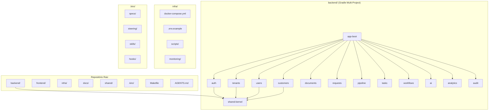
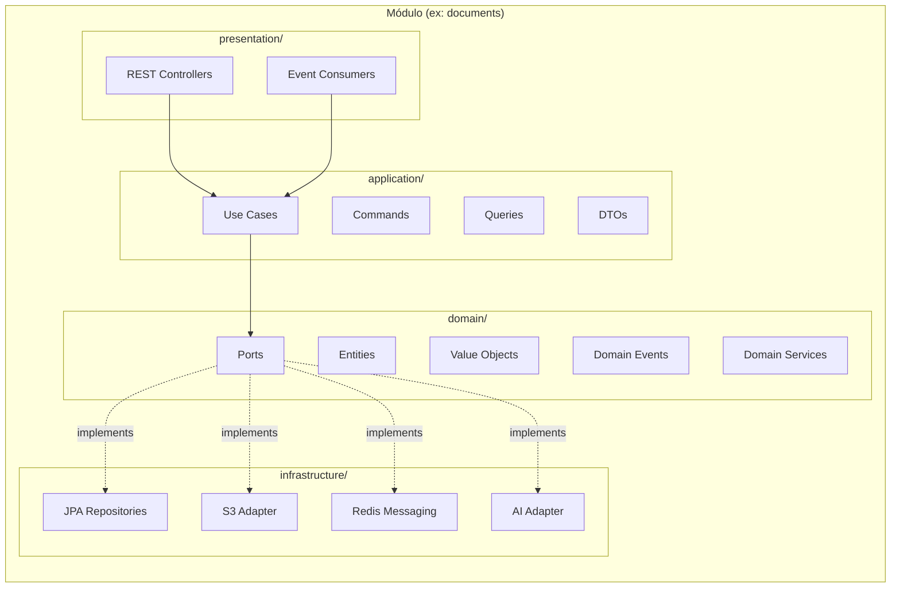
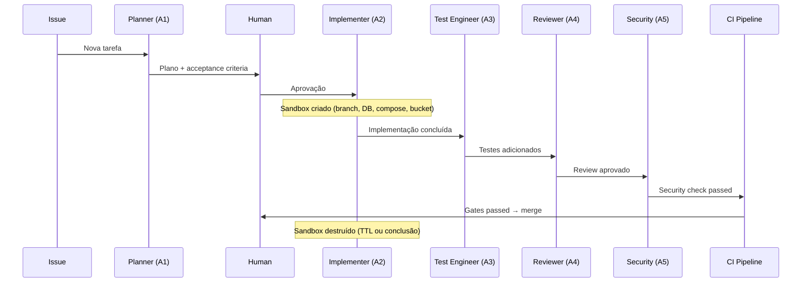
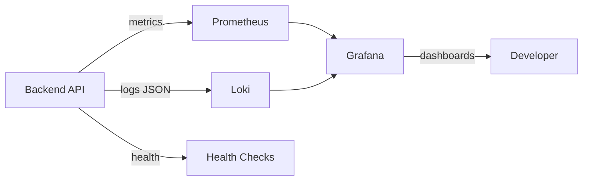

# Design Document — Monorepo SDD Harness

## Overview

Este design descreve a fundação técnica do AtlasOps AI: a estruturação como monorepo Gradle multi-project, o backend Spring Boot 3.x com arquitetura hexagonal, integração Spring AI com RAG local (Ollama + pgvector), infraestrutura Docker Compose para desenvolvimento, fluxo de Spec Driven Development (SDD), e o harness de engenharia com agentes de IA, sandboxes e quality gates.

O objetivo é criar a base estável sobre a qual todas as waves (1-10) serão construídas. A ênfase é em isolamento de domínio, reprodutibilidade do ambiente, segurança por design e automação de qualidade.

### Decisões-chave

- **Monorepo com Gradle multi-project**: Um único repositório com builds independentes por módulo, permitindo refatoração de fronteiras sem friction de múltiplos repos.
- **Arquitetura hexagonal por módulo**: Domain isolado de frameworks, ports definem contratos, adapters são substituíveis.
- **Spring AI com Ollama local**: Zero dependência de cloud para IA durante desenvolvimento, com fallback e human-in-the-loop.
- **Docker Compose como infraestrutura local**: Um comando levanta todo o stack (PostgreSQL+pgvector, Redis, MinIO, Ollama, Prometheus, Grafana, Loki, MailHog).
- **SDD integrado ao repo**: Specs versionadas junto ao código, rastreabilidade entre requisitos e implementação.
- **Harness com agentes isolados**: Cada agente opera em sandbox com recursos exclusivos, permissões explícitas e quality gates obrigatórios.

---

## Architecture

### Visão Geral do Monorepo



### Arquitetura Hexagonal por Módulo



### Fluxo de Dependência entre Camadas

```
presentation → application → domain ← infrastructure
                                ↑
                          shared-kernel
```

**Regras de dependência (validadas por ArchUnit):**

- `domain/` não importa `infrastructure/`, `presentation/`, nem frameworks externos
- `application/` não importa `infrastructure/` nem `presentation/`
- `presentation/` depende apenas de `application/` e `shared-kernel`
- `infrastructure/` implementa ports definidos em `domain/`
- Sem ciclos entre módulos

### Fluxo de Orquestração de Agentes



---

## Components and Interfaces

### 1. Build System (Gradle Multi-Project)

**Responsabilidade:** Compilação, teste, empacotamento e verificação de qualidade.

**Interfaces:**

- `settings.gradle.kts` — Declaração de todos os subprojetos via `include()`
- `gradle.properties` — Versões centralizadas (Java, Spring Boot, libs compartilhadas)
- Cada módulo expõe `build.gradle.kts` com dependências explícitas

**Plugins Gradle:**

- `java` / `java-library`
- `org.springframework.boot` (apenas no módulo `app-boot`)
- `io.spring.dependency-management`
- `com.diffplug.spotless` — Formatação
- `checkstyle` — Lint
- `com.github.spotbugs` — Análise estática
- `jacoco` — Cobertura
- `org.owasp.dependencycheck` — Vulnerabilidades
- Regra de arquitetura via ArchUnit em testes

### 2. Módulo shared-kernel

**Responsabilidade:** Tipos base e interfaces compartilhadas entre módulos.

```java
// Tipos base
public abstract class Entity<ID> { ... }
public abstract class AggregateRoot<ID> extends Entity<ID> { ... }
public abstract class ValueObject { ... }
public abstract class DomainEvent { ... }

// Ports compartilhados
public interface Clock { Instant now(); }
public interface IdGenerator { String generate(); }
public interface EventPublisher { void publish(DomainEvent event); }
```

### 3. Módulo app-boot

**Responsabilidade:** Ponto de entrada da aplicação Spring Boot. Agrega todos os módulos e configura beans de infraestrutura.

**Interfaces:**

- `@SpringBootApplication` com component scan dos módulos
- `application.yml` / `application-{profile}.yml`
- Health endpoints: `/actuator/health/liveness`, `/actuator/health/readiness`
- Metrics endpoint: `/actuator/prometheus`

### 4. Spring AI Integration (módulo ai)

**Interfaces:**

```java
// Port no domain
public interface AIAnalysisPort {
    AnalysisResult analyze(AnalysisRequest request);
    List<RelevantChunk> searchRelevant(String query, int maxResults, double minScore);
}

// Port de ingestão
public interface DocumentIngestionPort {
    IngestionResult ingest(Document document);
}
```

**Adapter (infrastructure):**

- `OllamaAIAdapter` — Implementa `AIAnalysisPort` via Spring AI Ollama
- `PgVectorSearchAdapter` — Implementa busca de similaridade
- `DocumentChunker` — Divide documentos em chunks (1000 tokens, overlap 200)

### 5. Sandbox Manager

**Interfaces:**

```java
public interface SandboxManager {
    SandboxResources provision(TaskContext task);
    void cleanup(String runId);
    void validateAccess(String runId, String resource);
}

public record SandboxResources(
    String runId,
    String branchName,
    String databaseName,
    String composeProject,
    String bucketPrefix,
    Instant expiresAt
) {}
```

### 6. Quality Gate Pipeline

**Interfaces (Makefile targets):**

| Target                  | Descrição                             |
| ----------------------- | ------------------------------------- |
| `make bootstrap`        | Setup completo de ambiente novo       |
| `make verify`           | Execução sequencial de todos os gates |
| `make test-unit`        | Testes unitários JUnit 5              |
| `make test-integration` | Testes de integração (requer Docker)  |
| `make build`            | Compilação e empacotamento            |
| `make compose-up`       | Inicia infraestrutura local           |
| `make compose-down`     | Para infraestrutura local             |
| `make compose-reset`    | Limpa e recria infraestrutura         |
| `make migrate`          | Executa migrations                    |
| `make seed`             | Popula dados de demonstração          |
| `make format`           | Formata código (Spotless)             |
| `make lint`             | Lint (Checkstyle + SpotBugs)          |
| `make doctor`           | Diagnóstico do ambiente               |

### 7. SDD Workflow

**Estrutura de diretórios:**

```
.kiro/
├── specs/
│   └── {feature-name}/
│       ├── .config.kiro
│       ├── requirements.md
│       ├── design.md
│       └── tasks.md
├── steering/
│   ├── java-conventions.md
│   ├── module-structure.md
│   ├── api-conventions.md
│   ├── testing-patterns.md
│   └── git-conventions.md
├── skills/
└── hooks/
```

### 8. Observability Stack

**Componentes:**



**Interfaces de Log (MDC):**

- `timestamp` (ISO 8601 UTC)
- `level`, `service`, `environment`
- `tenantId`, `actorId`, `correlationId`, `traceId`
- `event`, `resource`, `duration`, `errorCode`

---

## Data Models

### 1. Estrutura de Configuração do Monorepo

```
// settings.gradle.kts
rootProject.name = "atlasops-ai"

include(
    "backend:shared-kernel",
    "backend:auth",
    "backend:tenants",
    "backend:users",
    "backend:customers",
    "backend:documents",
    "backend:requests",
    "backend:pipeline",
    "backend:tasks",
    "backend:workflows",
    "backend:ai",
    "backend:analytics",
    "backend:audit",
    "backend:app-boot"
)
```

### 2. Modelo de Spec (SDD)

```json
// .config.kiro
{
    "specId": "uuid-v4",
    "workflowType": "sdd",
    "specType": "feature" | "fix"
}
```

### 3. Modelo de Sandbox

```
SandboxResources:
  - runId: "{issue}-agent-{role}" (ex: "ATLAS-42-agent-A2")
  - branchName: "sandbox/{runId}"
  - databaseName: "atlasops_{issue}" (ex: "atlasops_ATLAS_42")
  - composeProject: "atlasops_{issue}"
  - bucketPrefix: "{issue}/"
  - createdAt: Instant (UTC)
  - expiresAt: Instant (createdAt + 24h)
  - status: PROVISIONING | ACTIVE | CLEANING | CLEANED | EXPIRED
```

### 4. Modelo de Tarefa de Agente

```
AgentTask:
  - id: String (único)
  - objective: String (max 500 chars)
  - context: List<String> (módulos e arquivos)
  - outOfScope: List<String>
  - acceptanceCriteria: List<String> (min 1)
  - affectedInterfaces: List<String> | "nenhuma"
  - risks: List<String> | "nenhum identificado"
  - requiredTests: List<String> (min 1 comando)
  - validationCommands: List<String> (min 1 comando)
  - assignedAgent: AgentRole (A1-A11)
  - status: PENDING | IN_PROGRESS | DONE | BLOCKED | REJECTED
```

### 5. Modelo de Análise IA

```
AIAnalysisRecord:
  - id: String
  - tenantId: String
  - model: String (ex: "llama3.1:8b")
  - promptVersion: String (ex: "document-analysis:v3")
  - inputHash: String (SHA-256)
  - durationMs: Long
  - confidenceScore: Double (0.0-1.0)
  - fallback: Boolean
  - result: String (texto da resposta)
  - chunksUsed: List<String> (IDs dos chunks)
  - createdAt: Instant
```

### 6. Modelo de Approval (Human-in-the-loop)

```
PendingApproval:
  - id: String
  - analysisId: String (referência à análise de origem)
  - actionType: CREATE | UPDATE | DELETE
  - targetResource: String
  - payload: JSON
  - status: PENDING_APPROVAL | APPROVED | REJECTED
  - requestedBy: String (agentId ou analysisId)
  - decidedBy: String (userId, nullable)
  - decidedAt: Instant (nullable)
  - createdAt: Instant
```

### 7. Docker Compose Services

| Serviço    | Imagem                         | Porta Host (default) | Volume      |
| ---------- | ------------------------------ | -------------------- | ----------- |
| postgres   | postgres:16-alpine + pgvector  | 5432                 | pgdata      |
| redis      | redis:7-alpine                 | 6379                 | redisdata   |
| minio      | minio/minio:RELEASE.2024-01-01 | 9000                 | miniodata   |
| ollama     | ollama/ollama:0.3              | 11434                | ollamadata  |
| prometheus | prom/prometheus:v2.48          | 9090                 | -           |
| grafana    | grafana/grafana:10.2           | 3000                 | grafanadata |
| loki       | grafana/loki:2.9               | 3100                 | -           |
| mailhog    | mailhog/mailhog:v1.0.1         | 8025                 | -           |

### 8. Variáveis de Ambiente (.env)

```env
# Application
APP_ENV=local
APP_PORT=8080

# Database
POSTGRES_PORT=5432
DATABASE_URL=jdbc:postgresql://localhost:5432/atlasops
POSTGRES_USER=atlasops
POSTGRES_PASSWORD=atlasops_local

# Redis
REDIS_PORT=6379
REDIS_URL=redis://localhost:6379

# Object Storage
MINIO_PORT=9000
OBJECT_STORAGE_ENDPOINT=http://localhost:9000
OBJECT_STORAGE_BUCKET=atlasops-local
MINIO_ACCESS_KEY=minioadmin
MINIO_SECRET_KEY=minioadmin

# AI
OLLAMA_PORT=11434
AI_BASE_URL=http://localhost:11434

# Monitoring
GRAFANA_PORT=3000
PROMETHEUS_PORT=9090
LOKI_PORT=3100
MAILHOG_PORT=8025

# Security
JWT_ISSUER=atlasops-local
JWT_AUDIENCE=atlasops-api
JWT_SECRET=local-dev-secret-min-32-chars-long

# Logging
LOG_LEVEL=INFO
```

---

## Correctness Properties

_A property is a characteristic or behavior that should hold true across all valid executions of a system — essentially, a formal statement about what the system should do. Properties serve as the bridge between human-readable specifications and machine-verifiable correctness guarantees._

### Property 1: Environment Variable Validation

_For any_ subset of required environment variables that is incomplete (at least one variable absent or empty), the application startup SHALL fail with an error message listing exactly the names of the missing/empty variables.

**Validates: Requirements 3.7**

### Property 2: Structured Log Format Invariant

_For any_ log event emitted by the Backend API (regardless of level, module, or trigger), the JSON output SHALL contain all mandatory fields: timestamp (ISO 8601 UTC), level, service, environment, tenantId, actorId, correlationId, event, resource, duration, and errorCode.

**Validates: Requirements 3.10, 11.1**

### Property 3: Correlation ID Propagation

_For any_ HTTP request received by the Backend API, if the `X-Correlation-ID` header is present the system SHALL reuse that value, otherwise it SHALL generate a valid UUID v4; in both cases the correlation ID SHALL appear in the MDC context, all log entries for that request, and the `X-Correlation-ID` response header.

**Validates: Requirements 3.11, 11.4, 11.5**

### Property 4: Document Chunking Constraints

_For any_ text document of size > 0, the chunking algorithm SHALL produce chunks where: each chunk has at most 1000 tokens, consecutive chunks overlap by exactly 200 tokens (except the last), and every chunk is associated with the source document's identifier.

**Validates: Requirements 4.3**

### Property 5: RAG Query Result Bounds

_For any_ RAG query submitted to the system, the results SHALL contain at most 5 chunks, each with a similarity score >= 0.7, and the response SHALL include the identifiers of all chunks used in prompt composition.

**Validates: Requirements 4.4**

### Property 6: AI Analysis Record Completeness

_For any_ AI analysis performed (successful or fallback), the system SHALL persist a record containing all mandatory fields: model, promptVersion, inputHash (SHA-256), durationMs, confidenceScore (0.0-1.0), fallback (boolean), and result (text).

**Validates: Requirements 4.8**

### Property 7: Prompt Version Selection

_For any_ analysis type with multiple registered prompt versions, the system SHALL select and use the version marked as active for that analysis type, identified by name and sequential numeric version.

**Validates: Requirements 4.9**

### Property 8: Mutable AI Action Creates Approval

_For any_ AI analysis result that proposes a mutable action (create, update, or delete), the system SHALL create a PendingApproval record containing: analysisId, actionType, targetResource, payload, and status=PENDING_APPROVAL, before any mutation is executed.

**Validates: Requirements 4.10**

### Property 9: Spec Feature-Name Validation

_For any_ string used as feature-name in the SDD workflow, the system SHALL accept it only if it matches kebab-case format with at most 50 characters, and upon acceptance SHALL create the directory `.kiro/specs/{feature-name}/` with exactly three files: `requirements.md`, `design.md`, `tasks.md`.

**Validates: Requirements 6.1**

### Property 10: Task Status Markdown Representation

_For any_ task with a valid status transition (todo→in_progress, todo→done, in_progress→done, in_progress→blocked), the markdown representation SHALL be updated correctly: `- [x]` for done, `- [ ] [in_progress]` for in_progress, `- [ ] [blocked]` for blocked, `- [ ]` for todo.

**Validates: Requirements 6.3, 6.4**

### Property 11: Spec Completeness Detection

_For any_ spec directory under `.kiro/specs/`, if any of the four required files (`requirements.md`, `design.md`, `tasks.md`, `.config.kiro`) is missing, the validation SHALL flag the spec as incomplete and list exactly the missing file names.

**Validates: Requirements 6.8**

### Property 12: Agent Task Field Validation

_For any_ task payload submitted to an agent, if any required field (objective, context, outOfScope, acceptanceCriteria, affectedInterfaces, risks, requiredTests, validationCommands) is absent or empty, the system SHALL reject the task before execution and return the names of all missing/empty fields.

**Validates: Requirements 8.5, 8.7**

### Property 13: Prohibited Action Enforcement

_For any_ agent (A1-A11) attempting a prohibited action (access production secrets, merge to protected branch, execute destructive command outside sandbox), the system SHALL block the action, register an audit entry with timestamp, agent code, attempted action, and blocking reason, and notify the task owner.

**Validates: Requirements 8.6, 8.8**

### Property 14: Sandbox Naming Convention

_For any_ combination of issue identifier and agent role (A1-A11), the sandbox resources SHALL be named following the convention: `run_id={issue}-agent-{role}`, `database=atlasops_{issue}`, `compose_project=atlasops_{issue}`, `bucket_prefix={issue}/`.

**Validates: Requirements 9.2**

### Property 15: Cross-Sandbox Isolation

_For any_ two sandboxes active simultaneously, an operation from sandbox A attempting to access resources (database, bucket, branch) belonging to sandbox B SHALL be rejected, with the system validating that every read/write uses exclusively the namespace of the requesting sandbox's run_id.

**Validates: Requirements 9.4**

### Property 16: Sandbox Destructive Command Blocking

_For any_ destructive command (DROP, DELETE sem WHERE, rm -rf, truncate, force push) targeting resources outside the sandbox's namespace, the system SHALL block execution, prevent side effects, and log the attempt with timestamp, run_id, blocked command, and responsible agent.

**Validates: Requirements 9.5**

### Property 17: Seed Idempotency

_For any_ number of consecutive executions of `make seed` (n >= 1), the final database state SHALL be identical — containing exactly: 2 tenants (Alpha, Beta), at least one user per role per tenant, at least 3 customers per tenant, and at least 2 documents per customer — with no duplicate records created by repeated executions.

**Validates: Requirements 12.7**

---

## Error Handling

### Categorias de Erro

| Categoria                  | Comportamento                               | Exemplo                                              |
| -------------------------- | ------------------------------------------- | ---------------------------------------------------- |
| **Startup Fatal**          | Interrompe inicialização com mensagem clara | Variável de ambiente ausente, PostgreSQL inacessível |
| **Dependency Unavailable** | Degrada gracefully, marca fallback          | Ollama indisponível, pgvector down                   |
| **Validation Rejection**   | Retorna erro 400/422 com detalhes           | Task com campos ausentes, feature-name inválido      |
| **Permission Denied**      | Bloqueia ação + audit log                   | Agente fora de permissão, cross-sandbox              |
| **Sandbox Failure**        | Abort + cleanup parcial em 2 min            | Falha criação de DB, branch já existe                |
| **Quality Gate Failure**   | Interrompe pipeline com indicação de etapa  | Falha de lint, cobertura abaixo da meta              |

### Estratégias por Componente

#### Spring Boot Startup

- Validação de todas env vars obrigatórias antes de iniciar qualquer bean
- Timeout de 30s para conexão com PostgreSQL
- Falha imediata com listagem de todas as variáveis ausentes (fail-fast)
- Health checks com timeout individual de 5s por dependência

#### RAG Pipeline

- Documento sem texto → status FAILED com motivo (sem crash)
- Ollama timeout (120s) → fallback response com `fallback=true`
- pgvector indisponível → erro isolado, restante do sistema funciona
- Documento > 50MB → rejeição na validação de entrada

#### Sandbox Lifecycle

- Falha de provisioning → cleanup de recursos parciais em até 2 minutos
- TTL expirado (24h) → marcação para limpeza automática
- Comando destrutivo fora de namespace → block + audit (nunca executa)
- Erro de cleanup → retry com backoff, alertar após 3 tentativas

#### Quality Gates

- Falha em qualquer etapa → interrupção imediata, report com:
  - Nome da etapa que falhou
  - Módulo afetado
  - Descrição do erro da ferramenta
- Docker Compose ausente para `integrationTest` → mensagem com serviços faltantes + comando para iniciar

#### Agent Task Handling

- Campos obrigatórios ausentes → rejeição antes de qualquer execução
- Ação proibida → block + audit log + notificação
- Tarefa com acceptance criteria vazio → rejeição

### Formato Padrão de Erro (API)

```json
{
  "type": "https://atlasops/errors/{error-type}",
  "title": "Descrição legível do erro",
  "status": 400,
  "code": "ERROR_CODE_ESTAVEL",
  "detail": "Detalhes específicos da ocorrência",
  "traceId": "correlation-id-propagado"
}
```

---

## Testing Strategy

### Dual Testing Approach

Este projeto utiliza duas estratégias complementares de testes:

1. **Unit Tests (JUnit 5 + Mockito)** — Verificam exemplos específicos, edge cases e condições de erro
2. **Property-Based Tests (jqwik)** — Verificam propriedades universais que devem valer para todas as entradas válidas

### Biblioteca de Property-Based Testing

- **Framework:** [jqwik](https://jqwik.net/) — biblioteca PBT para JVM integrada ao JUnit 5
- **Razão:** Nativa no ecossistema Java/JUnit, suporte a Kotlin, boa integração com Spring Boot Test, geradores customizáveis
- **Configuração mínima:** 100 iterações por teste de propriedade (`@Property(tries = 100)`)

### Convenções de Teste

#### Unit Tests

- Naming: `should_resultado_when_condicao` (ex: `should_rejectTask_when_objectiveIsEmpty`)
- Builders: `TenantBuilder`, `UserBuilder`, `CustomerBuilder`, `TaskBuilder`, `AnalysisBuilder`
- Fixtures com defaults válidos, overridable por teste
- Mocking de ports via Mockito para isolamento do domínio
- Clock e IdGenerator injetáveis (determinísticos)

#### Property Tests

- Tag format: `Feature: monorepo-sdd-harness, Property {N}: {título}`
- Mínimo 100 iterações por propriedade
- Geradores customizados por domínio (feature-names, agent tasks, sandbox configs)
- Cada teste referencia a propriedade do design document

#### Integration Tests

- Requerem Docker Compose ativo
- Isolamento de tenant por teste
- Database limpo entre suítes (não entre testes individuais no mesmo scope)
- Timeout máximo de 30s por teste

### Cobertura de Código

| Escopo             | Linhas | Branches |
| ------------------ | ------ | -------- |
| Projeto total      | ≥ 75%  | ≥ 65%    |
| Módulos de domínio | ≥ 85%  | —        |

### Mapeamento Properties → Testes

| Property                           | Tipo de Teste    | Módulo                        |
| ---------------------------------- | ---------------- | ----------------------------- |
| P1: Env Variable Validation        | Property (jqwik) | app-boot                      |
| P2: Structured Log Format          | Property (jqwik) | shared-kernel / observability |
| P3: Correlation ID Propagation     | Property (jqwik) | app-boot                      |
| P4: Document Chunking              | Property (jqwik) | ai                            |
| P5: RAG Query Bounds               | Property (jqwik) | ai                            |
| P6: AI Analysis Record             | Property (jqwik) | ai                            |
| P7: Prompt Version Selection       | Property (jqwik) | ai                            |
| P8: Mutable Action Approval        | Property (jqwik) | ai                            |
| P9: Feature-Name Validation        | Property (jqwik) | shared-kernel / sdd           |
| P10: Task Status Markdown          | Property (jqwik) | shared-kernel / sdd           |
| P11: Spec Completeness             | Property (jqwik) | shared-kernel / sdd           |
| P12: Agent Task Validation         | Property (jqwik) | shared-kernel / harness       |
| P13: Prohibited Action Enforcement | Property (jqwik) | shared-kernel / harness       |
| P14: Sandbox Naming                | Property (jqwik) | shared-kernel / harness       |
| P15: Cross-Sandbox Isolation       | Property (jqwik) | shared-kernel / harness       |
| P16: Sandbox Destructive Block     | Property (jqwik) | shared-kernel / harness       |
| P17: Seed Idempotency              | Property (jqwik) | app-boot / seed               |

### Testes Adicionais (não-PBT)

| Critério                         | Tipo        | Estratégia                           |
| -------------------------------- | ----------- | ------------------------------------ |
| Req 1.x: Estrutura de diretórios | Smoke       | Script de verificação de paths       |
| Req 2.x: ArchUnit rules          | Integration | ArchUnit test suite                  |
| Req 3.x: Spring Boot startup     | Integration | @SpringBootTest com Testcontainers   |
| Req 5.x: Docker Compose          | Integration | docker compose up + health checks    |
| Req 7.x: AGENTS.md structure     | Smoke       | Markdown parser + section validation |
| Req 10.x: Quality gates          | Integration | Gradle task execution verification   |
| Req 13.x: Steering files         | Smoke       | File existence + header validation   |

### Ferramentas de Teste

| Ferramenta      | Propósito                            |
| --------------- | ------------------------------------ |
| JUnit 5         | Framework base de testes             |
| jqwik           | Property-based testing               |
| Mockito         | Mocking de ports e adapters          |
| ArchUnit        | Validação de regras arquiteturais    |
| Testcontainers  | Containers para testes de integração |
| AssertJ         | Assertions fluentes                  |
| Jacoco          | Cobertura de código                  |
| Spotless        | Verificação de formatação            |
| OWASP Dep-Check | Scan de vulnerabilidades             |
