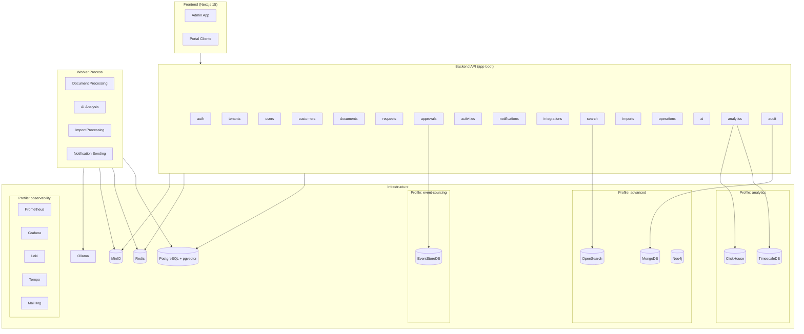

# Design Document — Project Adequation Restructure

## Overview

Este design detalha a adequação do projeto AtlasOps AI à nova visão arquitetural. O trabalho é fundamentalmente uma operação de reestruturação em 8 fases sequenciais, seguindo a diretriz **remover → alterar → criar → testar**.

A adequação transforma o projeto de 14 módulos (com 3 deprecados) para 18 módulos + Worker Process, adiciona Docker Compose profiles, scaffolding frontend Next.js 15, infraestrutura de testes (Playwright + k6), documentação de gap analysis, e atualiza toda a documentação de governança.

### Decisões de Design

| Decisão                                          | Rationale                                                                                                 |
| ------------------------------------------------ | --------------------------------------------------------------------------------------------------------- |
| Fases sequenciais com build gate                 | Cada fase é um commit independente. Se o build falhar, revert é trivial via `git revert`                  |
| Worker como módulo Spring Boot separado          | Processamento assíncrono pesado (IA, imports, previews) não compete com a API por thread pool e memória   |
| Docker Compose profiles                          | Desenvolvedores levantam apenas o que precisam — `core` para backend simples, `advanced` para busca/graph |
| pnpm workspace                                   | Alinhamento com ecossistema Next.js moderno, lockfile determinístico, eficiente em disco                  |
| Fallback por adapter com circuit breaker pattern | Cada database especializada é opcional; PostgreSQL é always-on como source of truth                       |
| DocumentAnalysisPort como contrato enriquecido   | Novo record de input/output alinhado com Target_Vision, suportando output schema e provider metadata      |

---

## Architecture

### Visão Geral do Sistema Pós-Adequação



### Estrutura de Módulos Pós-Adequação

```
backend/
├── shared-kernel/       # Tipos base, ports compartilhados
├── auth/                # Autenticação JWT
├── tenants/             # Multi-tenancy
├── users/               # Gestão de usuários
├── customers/           # Gestão de clientes
├── documents/           # Upload e gestão de documentos
├── requests/            # Solicitações de serviço
├── approvals/           # [NEW] Fluxos de aprovação (EventStoreDB)
├── activities/          # [NEW] Registro de atividades
├── notifications/       # [NEW] Envio de notificações
├── integrations/        # [NEW] Conectores externos (webhooks, MCP)
├── search/              # [NEW] Busca unificada (OpenSearch fallback PostgreSQL)
├── imports/             # [NEW] Importação de dados em lote
├── operations/          # [NEW] Operações administrativas e monitoramento
├── ai/                  # [ALTER] Renaming AIAnalysisPort → DocumentAnalysisPort
├── analytics/           # [KEEP] Dashboards e métricas
├── audit/               # [KEEP] Log de auditoria
├── app-boot/            # [ALTER] Remove deps de pipeline/tasks/workflows, adiciona novos
└── worker/              # [NEW] Processo assíncrono separado
```

### Fases de Execução

```mermaid
graph LR
    F1[Fase 1<br/>Docs Restructure] --> F2[Fase 2<br/>Remove Deprecated]
    F2 --> F3[Fase 3<br/>Create Modules]
    F3 --> F4[Fase 4<br/>Worker Process]
    F4 --> F5[Fase 5<br/>Docker Profiles]
    F5 --> F6[Fase 6<br/>Frontend Scaffold]
    F6 --> F7[Fase 7<br/>Gap Analysis Docs]
    F7 --> F8[Fase 8<br/>Update AGENTS.md]

    style F1 fill:#e8f5e9
    style F2 fill:#ffebee
    style F3 fill:#e3f2fd
    style F4 fill:#e3f2fd
    style F5 fill:#fff3e0
    style F6 fill:#e3f2fd
    style F7 fill:#f3e5f5
    style F8 fill:#f3e5f5
```



Cada fase termina com `./gradlew build` (exit code 0) como gate de progressão.

---

## Components and Interfaces

### Fase 1: Docs Restructuring

**Componente:** Script de movimentação de arquivos

```
docs/
├── README.md                    # [NEW] Índice com links relativos
├── architecture/                # [NEW]
│   ├── DESIGN-PLANNING.md
│   ├── HARNESS-LOOP-ENGINEERING-AND-AGENTS.md
│   └── DATA-ENTITIES-BY-DATABASE.md
├── specifications/              # [NEW]
│   ├── PROJECT-SCOPE.md
│   ├── TECHNICAL-SPECIFICATION.md
│   └── SPECIFICATION-PLANNING.md
├── task-plans/                  # [NEW]
│   ├── TASK-PLAN-P0-FOUNDATION-CORE.md
│   ├── TASK-PLAN-P1-EXPERIENCE-INTEGRATIONS.md
│   ├── TASK-PLAN-P2-SPECIALIZED-DATA.md
│   └── TASK-PLAN-P3-HARDENING-RELEASE.md
├── runbooks/                    # [NEW]
│   └── OPERATIONS-RUNBOOK.md
├── adr/                         # [KEEP] Inalterado
├── testing/                     # [NEW]
│   └── QUALITY-TESTING-CICD.md
└── diagrams/                    # [NEW]
    └── ARCHITECTURE-DIAGRAMS-C4-MERMAID.md
```

### Fase 2: Module Removal

**Operações:**

1. Remover `backend/pipeline/`, `backend/tasks/`, `backend/workflows/`
2. Remover entradas de `settings.gradle.kts`
3. Remover `implementation(project(...))` de `app-boot/build.gradle.kts`
4. Limpar imports residuais em outros módulos
5. Atualizar AGENTS.md

**Pré-condição de segurança:** Se algum módulo contiver `.java` além de `package-info.java`, abortar e reportar.

### Fase 3: New Modules — Interface Contracts

Cada novo módulo segue a estrutura hexagonal padrão e expõe pelo menos um port:

| Módulo          | Port Principal       | Métodos                                                                        |
| --------------- | -------------------- | ------------------------------------------------------------------------------ |
| `approvals`     | `ApprovalPort`       | `submitApproval(ApprovalRequest): ApprovalResult`                              |
| `activities`    | `ActivityRepository` | `record(ActivityEvent): void`, `findByEntity(String entityId): List<Activity>` |
| `notifications` | `NotificationPort`   | `send(Notification): NotificationResult`                                       |
| `integrations`  | `IntegrationPort`    | `dispatch(WebhookPayload): DispatchResult`                                     |
| `search`        | `SearchPort`         | `search(SearchQuery): SearchResult`                                            |
| `imports`       | `ImportPort`         | `startImport(ImportRequest): ImportJob`                                        |
| `operations`    | `OperationsPort`     | `getSystemHealth(): HealthStatus`                                              |

### Fase 4: Worker Process

```java
// com.atlasops.worker.WorkerApplication
@SpringBootApplication
public class WorkerApplication {
    public static void main(String[] args) {
        SpringApplication.run(WorkerApplication.class, args);
    }
}
```

**Dependências:**

- `shared-kernel` (tipos base)
- `documents` (processamento de documentos)
- `ai` (análise de IA)
- `notifications` (envio de notificações)
- `imports` (processamento de imports)

**Configuração (application.yml):**

- Redis: host, port, consumer group
- PostgreSQL: url, username, password (via env vars)
- MinIO: endpoint, access-key, secret-key (via env vars)

### Fase 5: Docker Compose Profiles

| Profile          | Serviços                                                         |
| ---------------- | ---------------------------------------------------------------- |
| `core`           | PostgreSQL (pgvector+PostGIS), Redis, MinIO, Backend API, Worker |
| `advanced`       | core + OpenSearch, MongoDB, Neo4j                                |
| `analytics`      | core + TimescaleDB, ClickHouse                                   |
| `event-sourcing` | core + EventStoreDB                                              |
| `observability`  | core + Prometheus, Grafana, Loki, Tempo, MailHog                 |

**Make targets:** `make compose-core`, `make compose-advanced`, `make compose-analytics`, `make compose-event-sourcing`, `make compose-observability`, `make compose-all`

### Fase 6: Frontend Scaffolding

**Stack:** Next.js 15, App Router, React 19, TypeScript strict, Tailwind CSS v4, shadcn/ui, pnpm

```
frontend/
├── app/
│   ├── globals.css           # Design tokens (CSS variables)
│   ├── layout.tsx            # Root layout
│   ├── admin/
│   │   ├── layout.tsx        # Admin layout (sidebar + header)
│   │   ├── dashboard/page.tsx
│   │   ├── customers/page.tsx
│   │   ├── customers/[id]/page.tsx
│   │   ├── requests/page.tsx
│   │   ├── requests/[id]/page.tsx
│   │   ├── documents/page.tsx
│   │   ├── documents/[id]/page.tsx
│   │   ├── approvals/page.tsx
│   │   ├── search/page.tsx
│   │   ├── activities/page.tsx
│   │   ├── operations/page.tsx
│   │   ├── integrations/page.tsx
│   │   ├── imports/page.tsx
│   │   ├── audit/page.tsx
│   │   └── settings/page.tsx
│   ├── portal/
│   │   ├── layout.tsx        # Portal layout (simpler nav)
│   │   ├── home/page.tsx
│   │   ├── requests/page.tsx
│   │   ├── requests/[id]/page.tsx
│   │   ├── documents/page.tsx
│   │   ├── documents/upload/page.tsx
│   │   └── notifications/page.tsx
│   └── developers/page.tsx
├── components/
│   ├── ui/                   # shadcn/ui generated
│   ├── shared/               # Layouts, navigation, data-table
│   ├── admin/                # Admin-specific
│   └── portal/               # Portal-specific
├── lib/                      # Utils, API client
├── hooks/                    # Custom hooks
├── package.json
├── tsconfig.json
├── next.config.ts
├── tailwind.config.ts
└── components.json           # shadcn/ui config
```

### Fase 6: AI Module Adequation (DocumentAnalysisPort)

**Renaming:** `AIAnalysisPort` → `DocumentAnalysisPort`

**Novo contrato de input:**

```java
public record DocumentAnalysisRequest(
    String tenantId,       // não-vazio
    String documentId,     // não-vazio
    String extractedText,  // não-vazio, máx 100.000 chars
    String promptVersion,  // formato "name:vN"
    String outputSchema    // não-vazio, schema identifier
) {
    public DocumentAnalysisRequest {
        // Validações no compact constructor
    }
}
```

**Novo contrato de output:**

```java
public record DocumentAnalysisResult(
    String summary,                    // não-vazio
    String category,                   // não-vazio
    List<KeyValuePair> extractedFields,// pares chave-valor
    List<String> risks,                // lista de riscos
    List<String> missingInformation,   // informações faltantes
    double confidenceScore,            // 0.0–1.0
    String providerMetadata,           // modelo e versão
    boolean fallback                   // resposta de fallback?
) {
    public DocumentAnalysisResult {
        // Validações no compact constructor
    }
}
```

**Interface renomeada:**

```java
public interface DocumentAnalysisPort {
    DocumentAnalysisResult analyze(DocumentAnalysisRequest request);
    List<RelevantChunk> searchRelevant(String query, int maxResults, double minScore);
}
```

---

## Data Models

### DocumentAnalysisRequest (Novo Record — AI Module)

| Campo           | Tipo     | Restrições                                               |
| --------------- | -------- | -------------------------------------------------------- |
| `tenantId`      | `String` | não-nulo, não-vazio                                      |
| `documentId`    | `String` | não-nulo, não-vazio                                      |
| `extractedText` | `String` | não-nulo, não-vazio, ≤ 100.000 caracteres                |
| `promptVersion` | `String` | não-nulo, formato regex `^[a-zA-Z][a-zA-Z0-9_-]*:v\\d+$` |
| `outputSchema`  | `String` | não-nulo, não-vazio                                      |

### DocumentAnalysisResult (Novo Record — AI Module)

| Campo                | Tipo                 | Restrições                |
| -------------------- | -------------------- | ------------------------- |
| `summary`            | `String`             | não-nulo, não-vazio       |
| `category`           | `String`             | não-nulo, não-vazio       |
| `extractedFields`    | `List<KeyValuePair>` | não-nula (pode ser vazia) |
| `risks`              | `List<String>`       | não-nula (pode ser vazia) |
| `missingInformation` | `List<String>`       | não-nula (pode ser vazia) |
| `confidenceScore`    | `double`             | ≥ 0.0 e ≤ 1.0             |
| `providerMetadata`   | `String`             | não-nulo, não-vazio       |
| `fallback`           | `boolean`            | —                         |

### KeyValuePair (Novo Record — AI Module)

| Campo   | Tipo     | Restrições          |
| ------- | -------- | ------------------- |
| `key`   | `String` | não-nulo, não-vazio |
| `value` | `String` | não-nulo            |

### Worker application.yml Schema

```yaml
spring:
  datasource:
    url: ${POSTGRES_URL:jdbc:postgresql://localhost:5432/atlasops}
    username: ${POSTGRES_USER:atlasops}
    password: ${POSTGRES_PASSWORD:atlasops_local}

  data:
    redis:
      host: ${REDIS_HOST:localhost}
      port: ${REDIS_PORT:6379}

atlasops:
  worker:
    consumer-group: atlasops-worker
  minio:
    endpoint: ${MINIO_ENDPOINT:http://localhost:9000}
    access-key: ${MINIO_ACCESS_KEY:minioadmin}
    secret-key: ${MINIO_SECRET_KEY:minioadmin}
  databases:
    opensearch:
      enabled: ${ATLASOPS_OPENSEARCH_ENABLED:false}
    mongodb:
      enabled: ${ATLASOPS_MONGODB_ENABLED:false}
    neo4j:
      enabled: ${ATLASOPS_NEO4J_ENABLED:false}
    timescaledb:
      enabled: ${ATLASOPS_TIMESCALEDB_ENABLED:false}
    clickhouse:
      enabled: ${ATLASOPS_CLICKHOUSE_ENABLED:false}
    eventstoredb:
      enabled: ${ATLASOPS_EVENTSTOREDB_ENABLED:false}
```

### Docker Compose Profile Structure

Cada serviço especializado é associado a um profile via diretiva `profiles:`:

```yaml
services:
  opensearch:
    profiles: ["advanced"]
    # ...
  mongodb:
    profiles: ["advanced"]
    # ...
  neo4j:
    profiles: ["advanced"]
    # ...
  timescaledb:
    profiles: ["analytics"]
    # ...
  clickhouse:
    profiles: ["analytics"]
    # ...
  eventstoredb:
    profiles: ["event-sourcing"]
    # ...
  tempo:
    profiles: ["observability"]
    # ...
```

---

## Correctness Properties

_A property is a characteristic or behavior that should hold true across all valid executions of a system — essentially, a formal statement about what the system should do. Properties serve as the bridge between human-readable specifications and machine-verifiable correctness guarantees._

### Property 1: DocumentAnalysisRequest rejects all invalid inputs

_For any_ input where tenantId is blank, or documentId is blank, or extractedText is blank, or extractedText exceeds 100,000 characters, or promptVersion does not match the format `name:vN`, or outputSchema is blank, constructing a `DocumentAnalysisRequest` SHALL throw an `IllegalArgumentException` and the record SHALL NOT be instantiated.

**Validates: Requirements 6.1**

### Property 2: DocumentAnalysisRequest accepts all valid inputs

_For any_ input where tenantId is non-blank, documentId is non-blank, extractedText is non-blank and ≤ 100,000 characters, promptVersion matches `^[a-zA-Z][a-zA-Z0-9_-]*:v\\d+$`, and outputSchema is non-blank, constructing a `DocumentAnalysisRequest` SHALL succeed without exception and all fields SHALL be accessible with the same values provided.

**Validates: Requirements 6.1**

### Property 3: DocumentAnalysisResult confidence score bounds

_For any_ confidence score value outside the range [0.0, 1.0], constructing a `DocumentAnalysisResult` SHALL throw an `IllegalArgumentException`. _For any_ confidence score within [0.0, 1.0] combined with valid non-blank summary, category, and providerMetadata, and non-null lists, the record SHALL be constructed successfully.

**Validates: Requirements 6.2**

### Property 4: DocumentAnalysisResult list immutability

_For any_ valid `DocumentAnalysisResult` instance, the lists returned by `extractedFields()`, `risks()`, and `missingInformation()` SHALL be immutable (unmodifiable). Attempting to mutate them SHALL throw `UnsupportedOperationException`.

**Validates: Requirements 6.2**

### Property 5: File move preserves content integrity

_For any_ document moved from the flat `docs/` root to a thematic subfolder, the SHA-256 hash of the file at the destination SHALL be identical to the SHA-256 hash of the file at the original source location.

**Validates: Requirements 1.2, 1.3, 1.4, 1.5, 1.6, 1.7, 1.8, 1.9, 1.10, 1.11**

---

## Error Handling

### Fase 2: Module Removal Safety

| Condição                                                    | Comportamento                                                       |
| ----------------------------------------------------------- | ------------------------------------------------------------------- |
| Módulo deprecado contém `.java` além de `package-info.java` | ABORT: interromper remoção, listar arquivos que precisam realocação |
| Build falha após remoção                                    | Revert do commit da fase, reportar erro                             |
| Referências residuais a módulo removido                     | Remover imports/dependencies automaticamente antes de compilar      |

### Fase 3: Module Creation Safety

| Condição                           | Comportamento                                                                      |
| ---------------------------------- | ---------------------------------------------------------------------------------- |
| Diretório de novo módulo já existe | ABORT: não sobrescrever, emitir mensagem de erro                                   |
| Build falha após criação           | Verificar `build.gradle.kts` e `settings.gradle.kts`, corrigir em até 3 tentativas |

### Fase 5: Docker Compose Profiles

| Condição                           | Comportamento                                                       |
| ---------------------------------- | ------------------------------------------------------------------- |
| Health check falha após 12 retries | Manter serviço em estado `unhealthy`, não reiniciar automaticamente |
| Profile não-core iniciado sem core | `depends_on` com `service_healthy` garante que core sobe primeiro   |

### Fase 6: AI Module — Persistence Fallback

| Serviço Indisponível   | Fallback                                                            |
| ---------------------- | ------------------------------------------------------------------- |
| OpenSearch             | Text search via PostgreSQL `tsvector`/`LIKE`                        |
| MongoDB                | Metadata em PostgreSQL, archive enfileira retry (5x, 30s intervalo) |
| Neo4j                  | Write principal sucede, projeção de grafo fica stale                |
| TimescaleDB/ClickHouse | Endpoints retornam `503` com indicação, ingestão enfileira retry    |
| DuckDB                 | Retorna erro `503 Service Temporarily Unavailable`                  |
| AI (Ollama)            | Fallback determinístico conforme módulo ai existente                |

**Circuit Breaker Pattern:**

1. Retry até 5 tentativas com intervalo de 30 segundos
2. Após esgotar retries: log ERROR com adapter name + timestamp, cessar tentativas
3. Health check periódico (60s) monitora reconexão
4. Quando serviço responde: retomar fluxo normal em até 60 segundos

### Fase 12: Sequencing Safety

| Condição                        | Comportamento                                               |
| ------------------------------- | ----------------------------------------------------------- |
| Build falha após uma fase       | Até 3 tentativas de correção automática                     |
| 3 tentativas esgotadas          | `git revert` do commit da fase, reportar ao líder técnico   |
| `make test-unit` falha no final | Listar testes com falha, não considerar adequação concluída |

---

## Testing Strategy

### Abordagem de Testes

Este feature é predominantemente scaffolding e reestruturação. A estratégia de testes se divide em:

1. **Property-Based Tests (jqwik)** — Para os novos records de domínio do módulo AI (`DocumentAnalysisRequest`, `DocumentAnalysisResult`, `KeyValuePair`)
2. **Unit Tests (JUnit 5)** — Para edge cases específicos e exemplos concretos
3. **Integration Tests** — Para validação de build, Docker Compose profiles, e compilação
4. **Smoke Tests** — Para verificação de estrutura de arquivos/diretórios

### Property-Based Tests (jqwik)

**Aplicabilidade:** Apenas para os novos records de domínio do módulo AI (Requisito 6).

**Configuração:**

- Framework: jqwik
- Iterações: `@Property(tries = 100)`
- Tag: `Feature: project-adequation-restructure, Property {N}: {título}`

**Tests a implementar:**

| Property   | Record                    | Foco                         |
| ---------- | ------------------------- | ---------------------------- |
| Property 1 | `DocumentAnalysisRequest` | Rejeição de inputs inválidos |
| Property 2 | `DocumentAnalysisRequest` | Aceitação de inputs válidos  |
| Property 3 | `DocumentAnalysisResult`  | Bounds de confidence score   |
| Property 4 | `DocumentAnalysisResult`  | Imutabilidade de listas      |

**Geradores customizados necessários:**

```java
@Provide
Arbitrary<String> validPromptVersions() {
    return Combinators.combine(
        Arbitraries.strings().alpha().ofMinLength(1).ofMaxLength(20),
        Arbitraries.integers().between(1, 100)
    ).as((name, version) -> name + ":v" + version);
}

@Provide
Arbitrary<String> validExtractedTexts() {
    return Arbitraries.strings()
        .ofMinLength(1)
        .ofMaxLength(100_000)
        .filter(s -> !s.isBlank());
}
```

### Unit Tests (JUnit 5)

**Módulo AI — Edge Cases:**

- `should_throwException_when_extractedTextExactly100001Chars()`
- `should_acceptText_when_extractedTextExactly100000Chars()`
- `should_throwException_when_promptVersionMissingColon()`
- `should_throwException_when_confidenceScoreIsNegativeEpsilon()`
- `should_createImmutableLists_when_mutableListProvided()`

**Build System — Verification:**

- Verificar que `settings.gradle.kts` não contém módulos deprecados
- Verificar que `app-boot/build.gradle.kts` não referencia módulos removidos
- Verificar que cada novo módulo contém `package-info.java` em todos os pacotes

### Integration Tests

- `./gradlew build` passa após cada fase
- Docker Compose `make compose-core` inicia e atinge healthy em 120s
- `pnpm --filter frontend build` compila sem erros TypeScript
- Worker compila independentemente: `./gradlew :backend:worker:build`

### Smoke Tests (Verificação de Estrutura)

- Todas as 7 subpastas existem em `docs/`
- `docs/README.md` existe e contém links para todos os documentos
- Cada novo módulo tem a estrutura hexagonal completa
- Frontend tem todas as rotas definidas como `page.tsx`
- Playwright config e k6 scripts existem nos diretórios corretos

### Ferramentas por Fase

| Fase         | Tipo de Teste      | Ferramenta                                       |
| ------------ | ------------------ | ------------------------------------------------ |
| 1 (Docs)     | Smoke              | Shell script / assertions                        |
| 2 (Remove)   | Integration        | `./gradlew build`                                |
| 3 (Create)   | Integration + Unit | `./gradlew build` + ArchUnit                     |
| 4 (Worker)   | Integration        | `./gradlew :backend:worker:build`                |
| 5 (Docker)   | Integration        | `docker compose --profile core up` + healthcheck |
| 6 (Frontend) | Integration        | `pnpm --filter frontend build`                   |
| 6 (AI)       | PBT + Unit         | jqwik + JUnit 5                                  |
| 7 (Docs)     | Smoke              | Structure verification                           |
| 8 (AGENTS)   | Smoke              | Content verification                             |

### Cobertura Esperada

| Escopo                               | Meta                               |
| ------------------------------------ | ---------------------------------- |
| Novos records AI (domain)            | ≥ 85% linhas                       |
| Módulos scaffold (package-info only) | N/A (sem lógica)                   |
| Worker main class                    | Excluído (Spring Boot entry point) |
