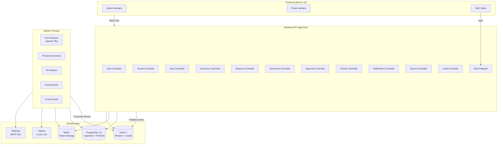
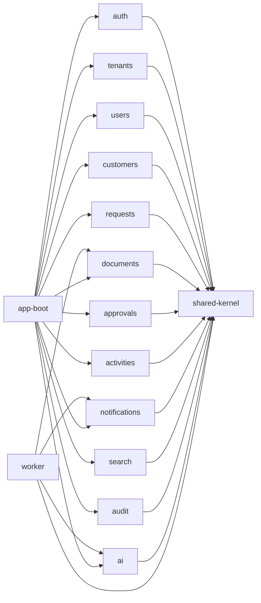
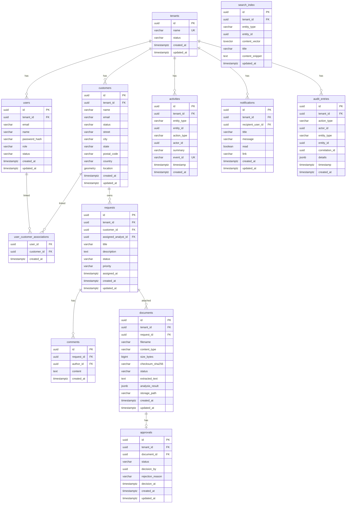
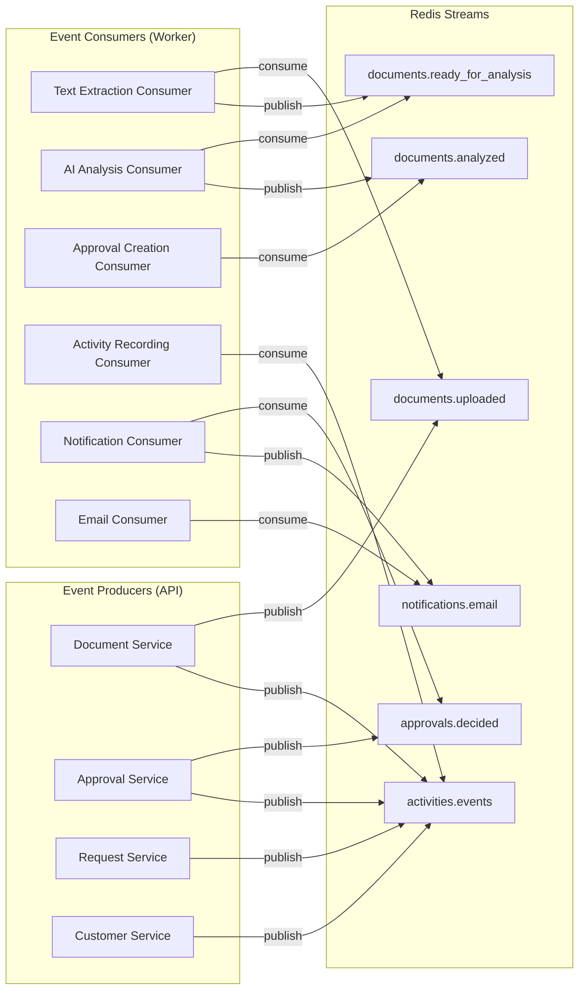
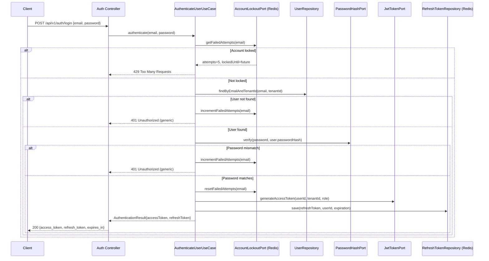
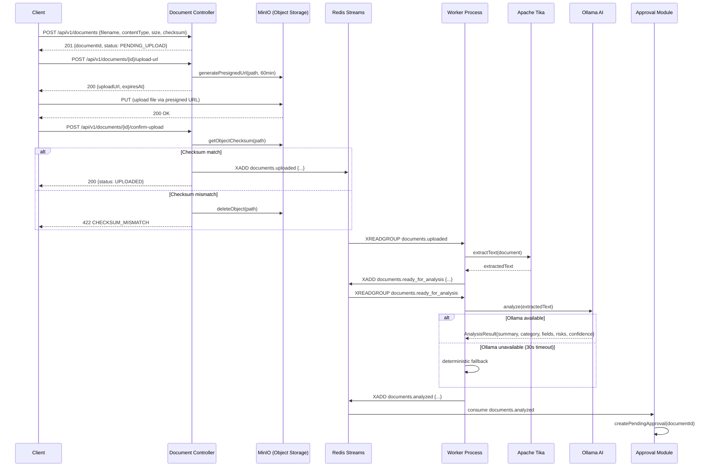
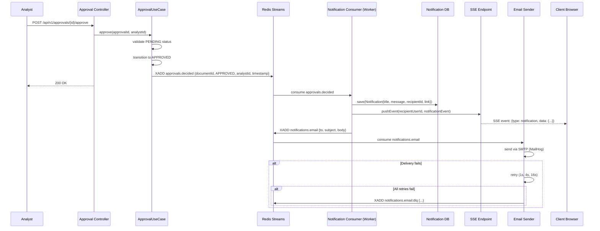
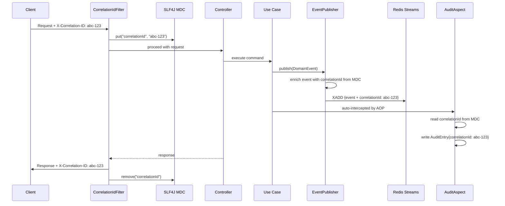

# Design Document: AtlasOps AI — P0 Implementation

## Overview

This design covers the full P0 (Priority Zero) implementation of the AtlasOps AI platform, delivering the primary end-to-end journey: customer creation → document upload → AI analysis → approval workflow → real-time notifications → audit logging.

The system follows hexagonal architecture per module with a shared-kernel providing base types. The backend is a Gradle multi-project (Java 21, Spring Boot 3.2+) communicating asynchronously via Redis Streams. The frontend is a Next.js 15 application with role-based interfaces.

**Key Design Decisions:**

1. **Hexagonal architecture** — Domain logic isolated from frameworks; ports define boundaries, adapters implement them.
2. **Event-driven asynchronous processing** — Heavy operations (text extraction, AI analysis, notifications) run in a separate Worker Process via Redis Streams, keeping the API responsive.
3. **Multi-tenant at every layer** — TenantId is a mandatory parameter in all repository ports; cross-tenant isolation enforced at query level returning 404 (not 403) for non-existent resources.
4. **JWT + Redis for auth** — Stateless access tokens with Redis-backed refresh token rotation and account lockout.
5. **Deterministic AI fallback** — When Ollama is unavailable, a deterministic fallback ensures the pipeline never blocks.

## Architecture

### System Component Diagram



### Module Dependency Graph



### Hexagonal Architecture per Module

```
┌──────────────────────────────────────────────────┐
│                  presentation/                     │
│  Controllers, Event Consumers, SSE Endpoints      │
├──────────────────────────────────────────────────┤
│                  application/                      │
│  Use Cases, Commands, Queries, DTOs               │
├──────────────────────────────────────────────────┤
│                    domain/                         │
│  Entities, Value Objects, Domain Events           │
│  ┌────────────────────────────────────────┐      │
│  │            domain/ports/                │      │
│  │  Repository interfaces, Service ports   │      │
│  └────────────────────────────────────────┘      │
├──────────────────────────────────────────────────┤
│                infrastructure/                     │
│  JPA Adapters, Redis Adapters, MinIO Adapters     │
└──────────────────────────────────────────────────┘
```

## Components and Interfaces

### Auth Module

**Domain:**

- `RefreshToken` — Entity tracking token value, user ID, expiration, and revocation status
- `AuthenticationResult` — Value object with access token, refresh token, and expiration metadata
- `Role` — Enum: ADMIN, ANALYST, CLIENT
- `AccountLockout` — Value object tracking failed attempts per email

**Ports:**

- `RefreshTokenRepository` — CRUD for refresh tokens in Redis
- `AccountLockoutPort` — Track/query failed login attempts in Redis
- `JwtTokenPort` — Generate and validate JWT tokens
- `PasswordHashPort` — Hash and verify passwords (bcrypt)

**Application (Use Cases):**

- `AuthenticateUserUseCase` — Validates credentials, issues tokens, manages lockout
- `RefreshTokenUseCase` — Rotates refresh token, issues new access token
- `LogoutUseCase` — Invalidates refresh token

**Presentation:**

- `AuthController` — POST `/api/v1/auth/login`, POST `/api/v1/auth/refresh`, POST `/api/v1/auth/logout`
- `JwtAuthenticationFilter` — Spring Security filter validating JWT on every request
- `TenantContextFilter` — Validates X-Tenant-ID header matches JWT tenant claim

### Tenants Module

**Domain:**

- `Tenant` — AggregateRoot with id, name, status (ACTIVE/INACTIVE), createdAt
- `TenantName` — Value object (3-100 chars, alphanumeric + hyphens + spaces)
- `TenantStatus` — Enum: ACTIVE, INACTIVE

**Ports:**

- `TenantRepository` — findById(TenantId), existsByName(TenantName), save(Tenant)

**Application:**

- `CreateTenantUseCase` — Creates tenant with uniqueness validation
- `DeactivateTenantUseCase` — Sets status to INACTIVE
- `GetTenantUseCase` — Retrieves tenant by ID

**Presentation:**

- `TenantController` — POST `/api/v1/tenants`, GET `/api/v1/tenants/{id}`, PATCH `/api/v1/tenants/{id}/deactivate`

### Users Module

**Domain:**

- `User` — AggregateRoot with id, email, name, passwordHash, role, tenantId, status, createdAt
- `UserStatus` — Enum: ACTIVE, INACTIVE

**Ports:**

- `UserRepository` — findByEmailAndTenantId, findById, save, existsByEmailAndTenantId

**Application:**

- `CreateUserUseCase` — Validates input, hashes password with bcrypt (cost ≥ 10), persists user
- `UpdateUserRoleUseCase` — Changes role with validation
- `DeactivateUserUseCase` — Marks inactive (prevents self-deactivation)

**Presentation:**

- `UserController` — POST `/api/v1/users`, GET `/api/v1/users/{id}`, PATCH `/api/v1/users/{id}/role`, PATCH `/api/v1/users/{id}/deactivate`

### Customers Module

**Domain:**

- `Customer` — AggregateRoot with id, name, email, address, status, tenantId, createdAt, location (PostGIS point)
- `Address` — Value object with street, city, state, postalCode, country, latitude, longitude
- `CustomerStatus` — Enum: ACTIVE, INACTIVE

**Ports:**

- `CustomerRepository` — CRUD + findByRadius(center, distanceKm, tenantId) + searchByNameOrEmail(query, tenantId, pageable)

**Application:**

- `CreateCustomerUseCase`, `UpdateCustomerUseCase`, `DeactivateCustomerUseCase`, `ActivateCustomerUseCase`
- `SearchCustomersUseCase` — Partial match search
- `FindCustomersByRadiusUseCase` — Geospatial query
- `AssociateClientUserUseCase` — Links CLIENT user to customer

**Presentation:**

- `CustomerController` — Full CRUD + `/api/v1/customers/search`, `/api/v1/customers/nearby`

### Requests Module

**Domain:**

- `ServiceRequest` — AggregateRoot with id, title, description, status, priority, customerId, assignedAnalystId, tenantId, createdAt
- `RequestStatus` — Enum with state machine: OPEN, IN_PROGRESS, WAITING_CUSTOMER, COMPLETED, CANCELLED
- `RequestPriority` — Enum: LOW, MEDIUM, HIGH, CRITICAL
- `Comment` — Entity with id, text, authorId, requestId, createdAt
- `RequestStatusTransition` — Value object defining allowed transitions

**Ports:**

- `ServiceRequestRepository` — CRUD + findByCustomerIdAndTenantId(pageable, filters)
- `CommentRepository` — findByRequestId(pageable)

**Application:**

- `CreateRequestUseCase` — Creates request with OPEN status, default MEDIUM priority
- `TransitionRequestStatusUseCase` — Validates state machine transitions
- `AssignAnalystUseCase` — Assigns analyst, transitions OPEN → IN_PROGRESS
- `AddCommentUseCase` — Adds comment with validation
- `AssociateDocumentUseCase` — Links document to request

**Presentation:**

- `RequestController` — CRUD + `/api/v1/requests/{id}/transition`, `/api/v1/requests/{id}/assign`, `/api/v1/requests/{id}/comments`

### Documents Module

**Domain:**

- `Document` — AggregateRoot with id, filename, contentType, sizeBytes, checksum, status, tenantId, requestId, extractedText, analysisResult, createdAt
- `DocumentStatus` — Enum: PENDING_UPLOAD, UPLOADED, TEXT_EXTRACTED, ANALYZED, UPLOAD_FAILED, PROCESSING_FAILED
- `AllowedContentType` — Enum: PDF, DOCX, PNG, JPEG
- Domain Events: `DocumentUploadedEvent`, `DocumentReadyForAnalysisEvent`, `DocumentAnalyzedEvent`

**Ports:**

- `DocumentRepository` — CRUD + findByTenantIdAndStatus
- `ObjectStoragePort` — generatePresignedUploadUrl, deleteObject, getObjectChecksum
- `TextExtractionPort` — extractText(inputStream, contentType) → String
- `PreviewGenerationPort` — generatePreview(inputStream) → byte[]

**Application:**

- `RegisterDocumentMetadataUseCase` — Creates PENDING_UPLOAD record with checksum declaration
- `InitiateUploadUseCase` — Generates presigned URL for MinIO
- `ConfirmUploadUseCase` — Validates checksum, transitions to UPLOADED, publishes event
- `ProcessDocumentUseCase` — Text extraction + preview generation (Worker)
- `AnalyzeDocumentUseCase` — AI analysis with fallback (Worker)

**Presentation:**

- `DocumentController` — POST `/api/v1/documents`, POST `/api/v1/documents/{id}/upload-url`, POST `/api/v1/documents/{id}/confirm-upload`

### Approvals Module

**Domain:**

- `Approval` — AggregateRoot with id, documentId, status, decisionBy, decisionTimestamp, rejectionReason, tenantId
- `ApprovalStatus` — Enum: PENDING, APPROVED, REJECTED, CANCELLED
- Domain Events: `ApprovalDecisionEvent`

**Ports:**

- `ApprovalRepository` — findByDocumentId, findPendingByTenantId(pageable)

**Application:**

- `CreatePendingApprovalUseCase` — Auto-creates when document reaches ANALYZED
- `ApproveDocumentUseCase` — Transitions PENDING → APPROVED
- `RejectDocumentUseCase` — Transitions PENDING → REJECTED with reason (10-1000 chars)
- `CancelApprovalUseCase` — ADMIN cancels PENDING → CANCELLED

**Presentation:**

- `ApprovalController` — POST `/api/v1/approvals/{id}/approve`, POST `/api/v1/approvals/{id}/reject`, POST `/api/v1/approvals/{id}/cancel`

### Activities Module

**Domain:**

- `Activity` — Entity with id, entityType, entityId, actionType, actorId, tenantId, summary, timestamp, eventId (for deduplication)

**Ports:**

- `ActivityRepository` — save, findByEntityAndTenantId(pageable), findByTenantId(pageable), existsByEventId

**Application:**

- `RecordActivityUseCase` — Creates activity from domain event with deduplication check
- `GetEntityActivitiesUseCase` — Queries by entity
- `GetTenantActivityFeedUseCase` — Global tenant feed

**Presentation:**

- `ActivityController` — GET `/api/v1/activities`, GET `/api/v1/activities?entityType=...&entityId=...`
- `ActivityEventConsumer` — Listens to domain events from Redis Streams

### Notifications Module

**Domain:**

- `Notification` — Entity with id, recipientUserId, tenantId, title, message, read, link, createdAt
- `EmailNotification` — Value object with to, subject, body, tenantName

**Ports:**

- `NotificationRepository` — save, findByUserAndTenantId(pageable), countUnreadByUser, markAsRead(ids)
- `EmailSenderPort` — sendEmail(EmailNotification)
- `SSEConnectionPort` — pushEvent(userId, event)

**Application:**

- `CreateNotificationUseCase` — Creates in-app notification
- `MarkNotificationsReadUseCase` — Marks one or bulk (max 100)
- `GetUnreadCountUseCase` — Returns unread count
- `SendEmailNotificationUseCase` — Async email with retry
- `PushSSEEventUseCase` — Pushes event to active SSE connections

**Presentation:**

- `NotificationController` — GET `/api/v1/notifications`, PATCH `/api/v1/notifications/mark-read`, GET `/api/v1/notifications/unread-count`
- `SSEController` — GET `/api/v1/events/stream?token={jwt}`
- `NotificationEventConsumer` — Listens to approval/request events

### Search Module

**Domain:**

- `SearchResult` — Value object with entityType, entityId, title, snippet, relevanceScore
- `SearchQuery` — Value object with query (2-200 chars), entityTypeFilter, tenantId

**Ports:**

- `SearchIndexPort` — search(SearchQuery, pageable) → Page<SearchResult>
- `SearchIndexUpdatePort` — indexEntity(entityType, entityId, content, tenantId)

**Application:**

- `UnifiedSearchUseCase` — Executes cross-entity search with tenant/role filtering
- `IndexEntityUseCase` — Updates search index when entities change

**Presentation:**

- `SearchController` — GET `/api/v1/search?q=...&page=...&size=...`

### Audit Module

**Domain:**

- `AuditEntry` — Immutable entity with id, actionType, actorId, tenantId, entityType, entityId, correlationId, details (JSON ≤ 10KB), timestamp

**Ports:**

- `AuditRepository` — append(AuditEntry), query(filters, pageable)

**Application:**

- `WriteAuditEntryUseCase` — Appends entry with retry on failure
- `QueryAuditEntriesUseCase` — Filtered paginated query

**Presentation:**

- `AuditController` — GET `/api/v1/audit?actorId=...&actionType=...&from=...&to=...`
- `AuditAspect` — AOP aspect intercepting critical actions to auto-write audit entries

### Observability (Cross-Cutting)

- `CorrelationIdFilter` — Servlet filter extracting/generating X-Correlation-ID, setting MDC
- `CorrelationIdEventEnricher` — Enriches all published domain events with correlation ID
- `MdcCleanupFilter` — Clears MDC after request completion

## Data Models

### Database Schema (ERD)



### Key Indexes

| Table         | Index                           | Type          | Purpose                     |
| ------------- | ------------------------------- | ------------- | --------------------------- |
| users         | `idx_users_tenant_id`           | B-tree        | Tenant isolation queries    |
| users         | `idx_users_email_tenant`        | B-tree UNIQUE | Email uniqueness per tenant |
| customers     | `idx_customers_tenant_id`       | B-tree        | Tenant isolation            |
| customers     | `idx_customers_email_tenant`    | B-tree UNIQUE | Email uniqueness per tenant |
| customers     | `idx_customers_location`        | GIST          | Geospatial radius queries   |
| requests      | `idx_requests_tenant_id`        | B-tree        | Tenant isolation            |
| requests      | `idx_requests_status`           | B-tree        | Status filtering            |
| requests      | `idx_requests_customer_id`      | B-tree        | Customer's requests lookup  |
| documents     | `idx_documents_tenant_id`       | B-tree        | Tenant isolation            |
| documents     | `idx_documents_status`          | B-tree        | Status filtering            |
| approvals     | `idx_approvals_status`          | B-tree        | Pending approval queries    |
| activities    | `idx_activities_entity`         | B-tree        | Entity activity lookup      |
| activities    | `idx_activities_event_id`       | B-tree UNIQUE | Deduplication               |
| notifications | `idx_notifications_user_unread` | B-tree        | Unread count                |
| audit_entries | `idx_audit_timestamp`           | B-tree        | Time range queries          |
| search_index  | `idx_search_content`            | GIN           | Full-text search            |

### Redis Data Structures

| Key Pattern                            | Type                         | TTL    | Purpose                                   |
| -------------------------------------- | ---------------------------- | ------ | ----------------------------------------- |
| `refresh_token:{tokenHash}`            | String (userId)              | 7 days | Refresh token lookup                      |
| `user_tokens:{userId}`                 | Set (tokenHashes)            | 7 days | All tokens for a user (bulk invalidation) |
| `lockout:{email}`                      | Hash (attempts, lockedUntil) | 15 min | Account lockout tracking                  |
| `sse_events:{userId}`                  | Stream                       | 60 min | Missed SSE events buffer                  |
| Stream: `documents.uploaded`           | Stream                       | —      | DocumentUploadedEvent queue               |
| Stream: `documents.ready_for_analysis` | Stream                       | —      | DocumentReadyForAnalysisEvent queue       |
| Stream: `documents.analyzed`           | Stream                       | —      | DocumentAnalyzedEvent queue               |
| Stream: `approvals.decided`            | Stream                       | —      | ApprovalDecisionEvent queue               |
| Stream: `notifications.email`          | Stream                       | —      | Email dispatch queue                      |
| Stream: `{stream}:dlq`                 | Stream                       | —      | Dead letter queue per stream              |

## Event Flows

### Redis Streams Event Topology



### Domain Event Types

| Event                           | Stream                         | Payload                                                                     |
| ------------------------------- | ------------------------------ | --------------------------------------------------------------------------- |
| `DocumentUploadedEvent`         | `documents.uploaded`           | documentId, tenantId, contentType, filename, storagePath, correlationId     |
| `DocumentReadyForAnalysisEvent` | `documents.ready_for_analysis` | documentId, tenantId, extractedText (truncated ref), correlationId          |
| `DocumentAnalyzedEvent`         | `documents.analyzed`           | documentId, tenantId, fallbackUsed, correlationId                           |
| `ApprovalDecisionEvent`         | `approvals.decided`            | documentId, decision, analystId, decisionTimestamp, tenantId, correlationId |
| `RequestStatusChangedEvent`     | `activities.events`            | requestId, previousStatus, newStatus, actorId, tenantId, correlationId      |
| `CustomerCreatedEvent`          | `activities.events`            | customerId, name, tenantId, actorId, correlationId                          |

## Sequence Diagrams

### Authentication Flow



### Document Upload and Processing Flow



### Approval Workflow and Notification Flow



### Correlation ID Propagation



## Module Interaction Patterns

### Event Publishing Pattern

All modules use the shared `EventPublisher` port to publish events. The infrastructure adapter serializes events to JSON and writes to the appropriate Redis Stream:

```java
// In application layer (Use Case)
public class ConfirmUploadUseCase {
    private final EventPublisher eventPublisher;

    public void execute(ConfirmUploadCommand cmd) {
        // ... validate checksum, update status ...
        eventPublisher.publish(new DocumentUploadedEvent(
            document.getId(), document.getTenantId(), document.getContentType()
        ));
    }
}
```

### Tenant Isolation Pattern

Every repository port method includes `TenantId` as a mandatory parameter:

```java
public interface CustomerRepository {
    Optional<Customer> findById(String id, TenantId tenantId);
    Page<Customer> findAll(TenantId tenantId, Pageable pageable);
    boolean existsByEmail(Email email, TenantId tenantId);
    void save(Customer customer);
}
```

The infrastructure adapter always includes `tenant_id = ?` in SQL queries. If a result is found but its tenant doesn't match (defense-in-depth), it's treated as not-found.

### Worker Consumer Pattern

Each consumer uses Redis consumer groups for at-least-once delivery:

```java
// Pseudo-pattern for Worker consumers
@Component
public class TextExtractionConsumer {
    // XREADGROUP GROUP text-extraction-cg consumer-1 COUNT 10 BLOCK 2000 STREAMS documents.uploaded >
    // On success: XACK
    // On failure: retry 3x with backoff, then DLQ
}
```

## Correctness Properties

_A property is a characteristic or behavior that should hold true across all valid executions of a system — essentially, a formal statement about what the system should do. Properties serve as the bridge between human-readable specifications and machine-verifiable correctness guarantees._

### Property 1: JWT Claims Completeness

_For any_ authenticated user (regardless of role, tenant, or user identity), the generated JWT access token SHALL contain exactly three claims — userId, tenantId, and role — and the decoded values SHALL match the authenticated user's attributes.

**Validates: Requirements 1.3**

### Property 2: Invalid Credentials Produce Generic Error

_For any_ credential pair where either the email is incorrect OR the password is incorrect (but not both format-invalid), the authentication error response SHALL be identical in structure and message content, never revealing which specific field caused the failure.

**Validates: Requirements 1.2**

### Property 3: Refresh Token Rotation Invalidates Previous

_For any_ valid refresh token that is submitted for rotation, the system SHALL return a new access token and a new refresh token, AND the previously issued refresh token SHALL be rejected on any subsequent usage attempt.

**Validates: Requirements 1.4, 1.6**

### Property 4: Account Lockout Threshold

_For any_ email address, if exactly N consecutive failed authentication attempts occur within a 15-minute window (where N ranges from 1 to 10), the account SHALL be locked if and only if N ≥ 5, and a successful authentication at any point before lockout SHALL reset the counter to zero.

**Validates: Requirements 1.11, 1.12**

### Property 5: Role-Based Access Matrix

_For any_ combination of user role (ADMIN, ANALYST, CLIENT) and endpoint access level (ADMIN-only, ANALYST-only, authenticated), the system SHALL grant access if and only if the user's role is at least as privileged as the endpoint requirement (ADMIN > ANALYST > CLIENT for admin endpoints), returning 403 Forbidden for insufficient privilege.

**Validates: Requirements 2.1, 2.2, 2.3, 2.4**

### Property 6: Tenant Context Validation

_For any_ authenticated request, if the tenant identifier in the JWT claims differs from the X-Tenant-ID request header, the system SHALL return 403 Forbidden. If the X-Tenant-ID header is absent, the system SHALL return 400 Bad Request.

**Validates: Requirements 2.5, 2.6, 2.8**

### Property 7: Cross-Tenant Data Isolation

_For any_ resource belonging to tenant A and any authenticated user from tenant B (where A ≠ B), querying that resource SHALL return 404 Not Found (never 403 or the actual data), regardless of whether the resource exists.

**Validates: Requirements 4.1, 4.2, 4.6**

### Property 8: Tenant Name Uniqueness (Case-Insensitive)

_For any_ two tenant names that are equivalent under case-insensitive comparison, the second creation attempt SHALL be rejected, regardless of the character casing used.

**Validates: Requirements 3.2, 3.3**

### Property 9: Email Uniqueness Within Tenant

_For any_ two email addresses that are equivalent under case-insensitive comparison within the same tenant, the second user (or customer) creation SHALL return 409 Conflict, but the same email in a different tenant SHALL be accepted.

**Validates: Requirements 5.3, 6.2**

### Property 10: Password Storage Security

_For any_ user password stored in the system, the bcrypt hash SHALL have a cost factor of at least 10, and the original password SHALL NOT be recoverable from the hash (verified by inspecting the `$2a$` or `$2b$` prefix and cost parameter).

**Validates: Requirements 5.9**

### Property 11: Request Status State Machine

_For any_ service request in a given status, a transition attempt to a target status SHALL succeed if and only if the (current, target) pair is in the set {(OPEN, IN_PROGRESS), (OPEN, CANCELLED), (IN_PROGRESS, WAITING_CUSTOMER), (IN_PROGRESS, COMPLETED), (IN_PROGRESS, CANCELLED), (WAITING_CUSTOMER, IN_PROGRESS), (WAITING_CUSTOMER, CANCELLED)}, returning 422 with valid targets for any disallowed transition.

**Validates: Requirements 8.3, 8.4**

### Property 12: Coordinate Validation Bounds

_For any_ latitude value outside [-90, 90] or longitude value outside [-180, 180], the system SHALL reject the input with 400 Bad Request. _For any_ values within these ranges, the system SHALL accept and store them as a PostGIS geometry point.

**Validates: Requirements 7.3, 7.4**

### Property 13: Radius Query Correctness

_For any_ set of customer locations, a center point, and a radius in kilometers, the returned results SHALL contain only customers whose distance from the center is ≤ the radius, AND the results SHALL be ordered by distance ascending.

**Validates: Requirements 7.2**

### Property 14: Document Content Type Validation

_For any_ content type string, document registration SHALL accept it if and only if it is one of {application/pdf, application/vnd.openxmlformats-officedocument.wordprocessingml.document, image/png, image/jpeg}, returning 400 for any other value.

**Validates: Requirements 9.2, 9.3**

### Property 15: Checksum Verification Round-Trip

_For any_ document where the declared SHA-256 checksum at registration time matches the actual uploaded file's SHA-256 checksum, confirmation SHALL transition the document to UPLOADED status. _For any_ mismatch, the document SHALL transition to UPLOAD_FAILED and the stored object SHALL be deleted.

**Validates: Requirements 10.2, 10.3, 10.4**

### Property 16: MinIO Storage Path Format

_For any_ document with a given tenantId, upload timestamp, documentId, and filename, the storage path SHALL follow the pattern `{tenantId}/{year}/{month}/{documentId}/{filename}` where the filename is restricted to alphanumeric characters, hyphens, underscores, and dots.

**Validates: Requirements 10.5**

### Property 17: Idempotent Document Processing

_For any_ document whose status is already beyond UPLOADED (i.e., TEXT_EXTRACTED, ANALYZED, or any terminal state), receiving a DocumentUploadedEvent SHALL result in no state changes, no side effects, and the event SHALL be acknowledged.

**Validates: Requirements 11.7**

### Property 18: AI Fallback Determinism

_For any_ document analysis request where the AI provider is unavailable or times out, the fallback result SHALL always produce: a category based on content type, a word count summary, empty risk indicators, confidence score exactly 0.0, and fallback flag set to true.

**Validates: Requirements 12.3**

### Property 19: Approval State Machine Immutability

_For any_ approval record not in PENDING status (APPROVED, REJECTED, or CANCELLED), any subsequent approval or rejection attempt SHALL be rejected with 422, preserving the original decision intact.

**Validates: Requirements 13.7**

### Property 20: Approval Role Enforcement

_For any_ user with role CLIENT attempting an approval action (approve, reject, or cancel), the system SHALL deny the action with 403 Forbidden. Only users with ANALYST or ADMIN role SHALL be permitted.

**Validates: Requirements 13.4, 13.5**

### Property 21: Activity Deduplication

_For any_ domain event delivered more than once (same eventId), the Activity Module SHALL create exactly one activity entry, rejecting duplicates silently without error.

**Validates: Requirements 14.7**

### Property 22: Notification Isolation

_For any_ notification query, the results SHALL contain only notifications where the recipientUserId matches the authenticated user AND the tenantId matches the authenticated tenant. Cross-user or cross-tenant notifications SHALL never be visible.

**Validates: Requirements 15.7, 15.9**

### Property 23: Audit Entry Immutability

_For any_ existing audit entry in the database, an UPDATE or DELETE operation SHALL raise a database exception (enforced by trigger), ensuring the ledger is strictly append-only.

**Validates: Requirements 19.2, 19.3**

### Property 24: Worker Retry and DLQ Progression

_For any_ processing task that fails, the system SHALL retry exactly 3 times with exponential backoff (1s, 4s, 16s). After all retries are exhausted, the message SHALL be moved to the DLQ stream (`{originalStream}:dlq`) preserving the original content, attempt count, last error, and timestamp.

**Validates: Requirements 20.2, 20.3**

### Property 25: Correlation ID Propagation

_For any_ HTTP request, if an X-Correlation-ID header is present (non-blank), that exact value SHALL appear in: the response X-Correlation-ID header, all domain events published during that request (correlationId field), and all log entries (MDC key "correlationId"). If the header is absent or blank, a generated UUID v4 SHALL be used in all three locations consistently.

**Validates: Requirements 27.1, 27.2, 27.3, 27.4, 27.5**

### Property 26: MDC Cleanup After Request

_For any_ request (whether successful or failed with exception), after the response is committed, the MDC context SHALL NOT contain the correlationId key, preventing leakage between requests on thread-pooled threads.

**Validates: Requirements 27.6**

### Property 27: Search Result Tenant Isolation

_For any_ search query executed by a user, all returned results SHALL belong to the authenticated user's tenant. Additionally, if the user has CLIENT role, results SHALL be further restricted to entities associated with that client's customer.

**Validates: Requirements 18.4, 18.5**

### Property 28: Pagination Bounds Enforcement

_For any_ paginated API endpoint, requesting a page size greater than the maximum (100 for most, 50 for search, 200 for audit) SHALL either cap the result at the maximum or reject with a validation error. The returned result count SHALL never exceed the effective page size.

**Validates: Requirements 6.10, 8.9, 14.4, 15.8, 18.6, 19.5**

## Error Handling

### Error Response Format (RFC 7807)

All API errors follow the standardized Problem Details format:

```json
{
  "type": "https://atlasops/errors/{error-type}",
  "title": "Human-readable error title",
  "status": 400,
  "code": "VALIDATION_FAILED",
  "detail": "Specific occurrence details",
  "traceId": "correlation-id"
}
```

### Error Categories

| Category                | HTTP Status | Code                                                  | Recovery              |
| ----------------------- | ----------- | ----------------------------------------------------- | --------------------- |
| Validation failure      | 400         | VALIDATION_FAILED                                     | Fix input             |
| Missing auth            | 401         | UNAUTHORIZED                                          | Re-authenticate       |
| Expired token           | 401         | TOKEN_EXPIRED                                         | Refresh token         |
| Insufficient role       | 403         | FORBIDDEN_ACTION                                      | Contact admin         |
| Resource not found      | 404         | RESOURCE_NOT_FOUND                                    | Verify ID             |
| Duplicate resource      | 409         | DUPLICATE_RESOURCE                                    | Use different values  |
| Business rule violation | 422         | Various (INVALID_TRANSITION, CHECKSUM_MISMATCH, etc.) | Follow error guidance |
| Account locked          | 429         | ACCOUNT_LOCKED                                        | Wait 15 minutes       |
| External service down   | 503         | DEPENDENCY_UNAVAILABLE                                | Retry later           |

### Retry Strategies

| Operation              | Max Retries      | Backoff                 | Fallback                |
| ---------------------- | ---------------- | ----------------------- | ----------------------- |
| AI Analysis (Ollama)   | 0 (timeout only) | N/A                     | Deterministic fallback  |
| Text Extraction (Tika) | 3                | 1s, 5s, 30s             | PROCESSING_FAILED → DLQ |
| Email Delivery (SMTP)  | 3                | 1s, 4s, 16s             | DLQ                     |
| Audit Write (DB)       | 1                | 1s                      | Log ERROR, proceed      |
| Worker Task (generic)  | 3                | 1s, 4s, 16s             | DLQ                     |
| Redis Reconnection     | ∞                | 1s, 2s, 4s, ... max 30s | Resume from last ACK    |

### Global Exception Handler

```java
@RestControllerAdvice
public class GlobalExceptionHandler {
    // Maps domain exceptions to RFC 7807 responses
    // Always includes correlationId from MDC
    // Never leaks stack traces in non-dev profiles
    // Logs at appropriate level (WARN for 4xx, ERROR for 5xx)
}
```

## Testing Strategy

### Dual Testing Approach

This project uses two complementary testing strategies:

1. **Unit Tests (JUnit 5 + Mockito)** — Verify specific examples, edge cases, and error conditions
2. **Property-Based Tests (jqwik)** — Verify universal properties across all valid inputs (100+ iterations)

### Property-Based Testing Configuration

- **Framework:** jqwik (native JVM PBT, JUnit 5 compatible)
- **Minimum iterations:** 100 per property (`@Property(tries = 100)`)
- **Tag format:** `Feature: project-implementation-kickoff, Property {N}: {title}`
- **Generators:** Custom domain generators for Email, TenantId, TenantName, Role, RequestStatus, DocumentStatus, Coordinates, etc.

### Test Structure per Module

```
src/test/java/com/atlasops/{module}/
├── domain/
│   ├── {Entity}Test.java              # Unit tests for domain logic
│   └── {Entity}PropertyTest.java      # PBT for domain invariants
├── application/
│   ├── {UseCase}Test.java             # Unit tests with mocked ports
│   └── {UseCase}PropertyTest.java     # PBT for use case properties
├── infrastructure/
│   └── {Adapter}IntegrationTest.java  # Testcontainers integration tests
├── presentation/
│   └── {Controller}Test.java          # MockMvc controller tests
└── testfixtures/
    ├── {Name}Builder.java             # Test data builders
    └── TestFixtures.java              # Shared constants
```

### Key Test Categories

| Category         | What it tests                                    | Framework                | When to use         |
| ---------------- | ------------------------------------------------ | ------------------------ | ------------------- |
| Domain unit      | Entity invariants, value objects, state machines | JUnit 5 + jqwik          | Always              |
| Application unit | Use case orchestration, validation               | JUnit 5 + Mockito        | Always              |
| Property         | Universal correctness properties                 | jqwik (100 iterations)   | For properties 1-28 |
| Integration      | DB queries, Redis ops, MinIO, Tika               | Testcontainers           | Adapter layer       |
| Controller       | HTTP contract, serialization                     | MockMvc                  | Presentation layer  |
| Architecture     | Dependency rules, no cycles                      | ArchUnit                 | Once per module     |
| Frontend         | Component rendering, interactions                | Vitest + Testing Library | React components    |
| E2E              | Full user journeys                               | Playwright               | Critical paths      |

### Custom Generators (jqwik)

```java
@Provide
Arbitrary<Email> validEmails() {
    return Arbitraries.strings()
        .withCharRange('a', 'z').ofMinLength(3).ofMaxLength(20)
        .map(local -> new Email(local + "@test.com"));
}

@Provide
Arbitrary<TenantName> validTenantNames() {
    return Arbitraries.strings()
        .withChars("abcdefghijklmnopqrstuvwxyz0123456789- ")
        .ofMinLength(3).ofMaxLength(100)
        .filter(s -> !s.isBlank());
}

@Provide
Arbitrary<RequestStatus> anyRequestStatus() {
    return Arbitraries.of(RequestStatus.values());
}

@Provide
Arbitrary<Coordinates> validCoordinates() {
    return Combinators.combine(
        Arbitraries.doubles().between(-90.0, 90.0),
        Arbitraries.doubles().between(-180.0, 180.0)
    ).as(Coordinates::new);
}
```

### Coverage Requirements

| Scope          | Lines                                                           | Branches |
| -------------- | --------------------------------------------------------------- | -------- |
| Project total  | ≥ 75%                                                           | ≥ 65%    |
| Domain modules | ≥ 85%                                                           | —        |
| Exclusions     | package-info, @Configuration, Records without logic, Main class |
