# AtlasOps AI — Architecture Diagrams: C4 and Mermaid

## 1. C4 System Context

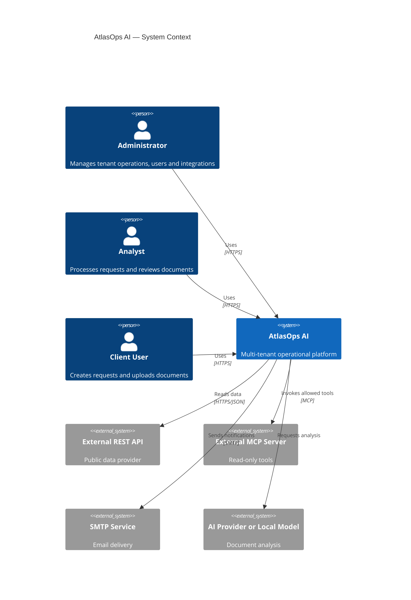

## 2. C4 Container Diagram

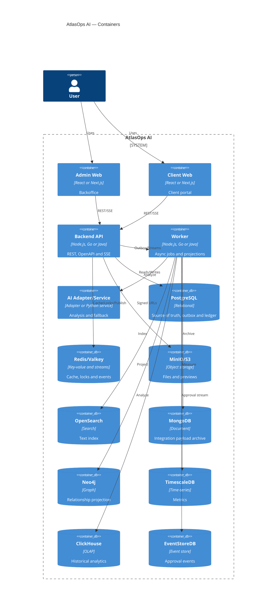

## 3. Primary Journey

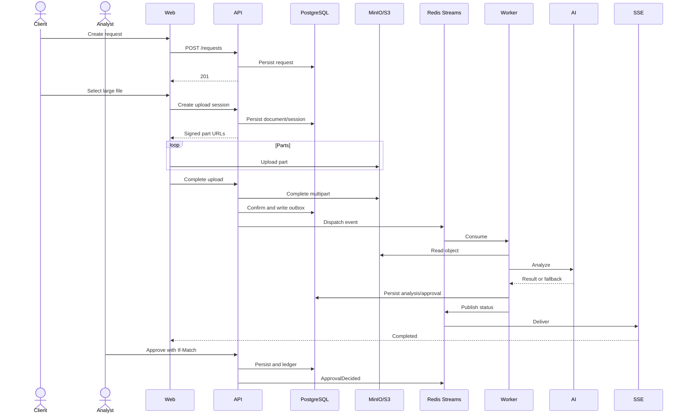

## 4. Multipart Upload State

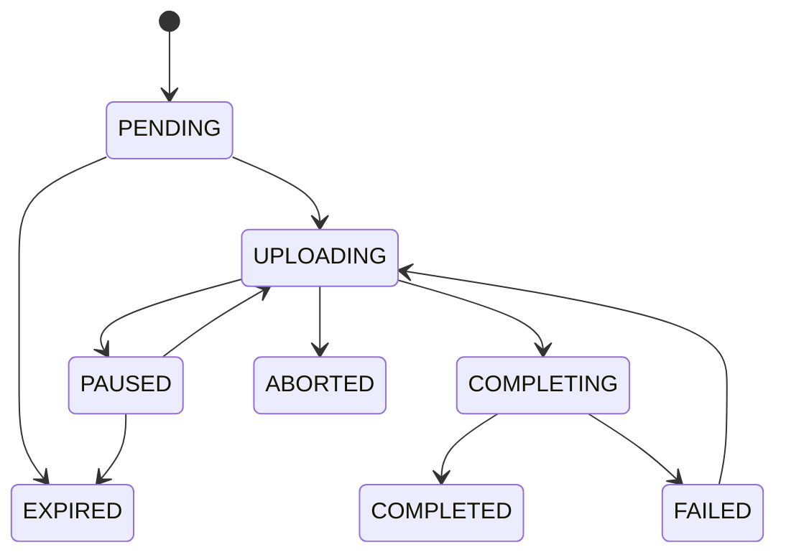

## 5. Request State

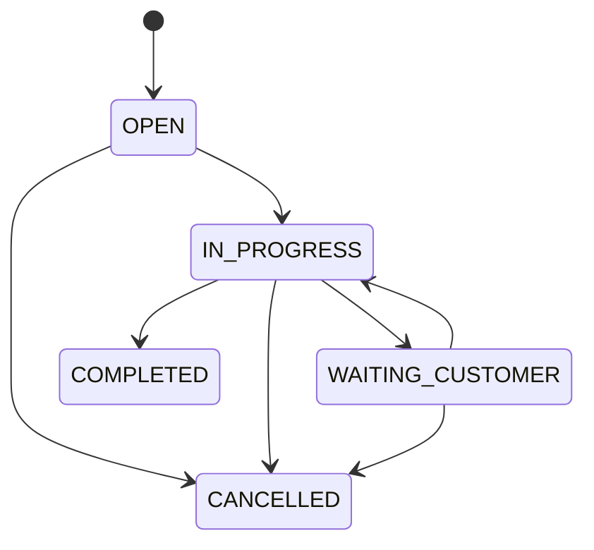

## 6. Document State

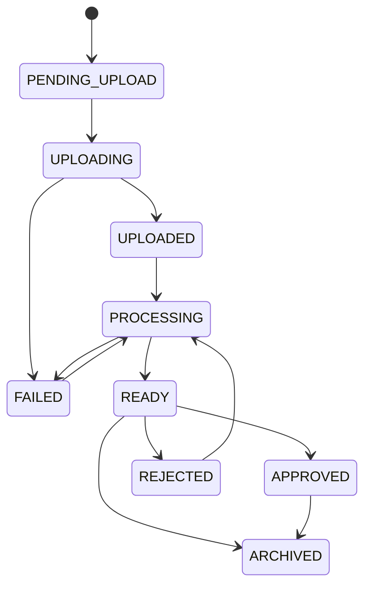

## 7. Outbox and Projections

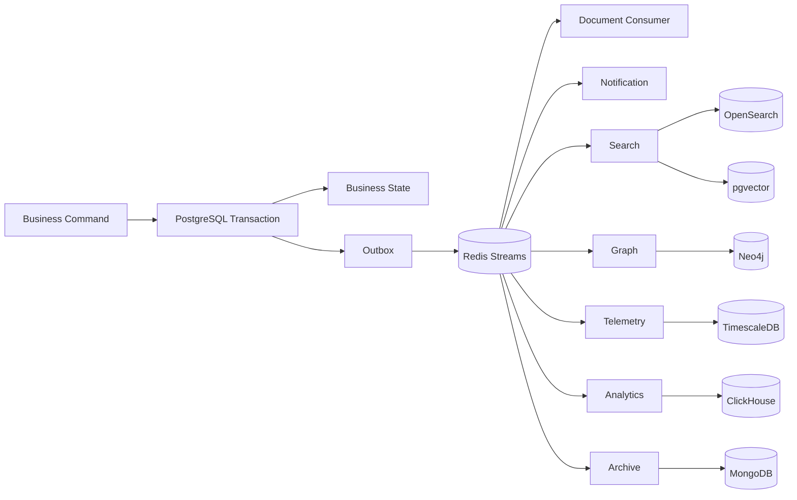

## 8. Hybrid Search

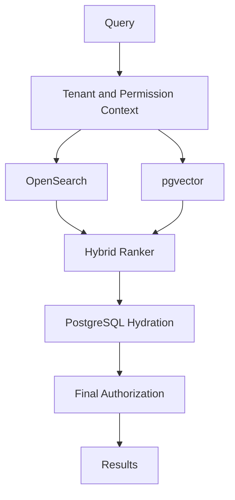

## 9. Approval Event Sourcing

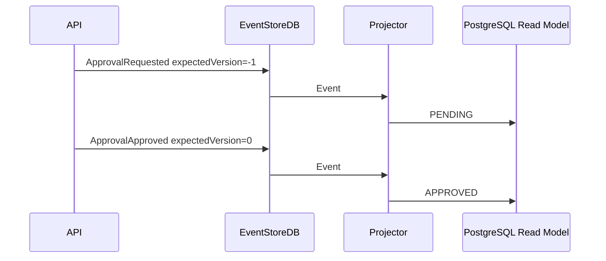

## 10. Verification Pipeline

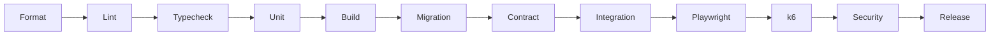

## 11. Agent Loop

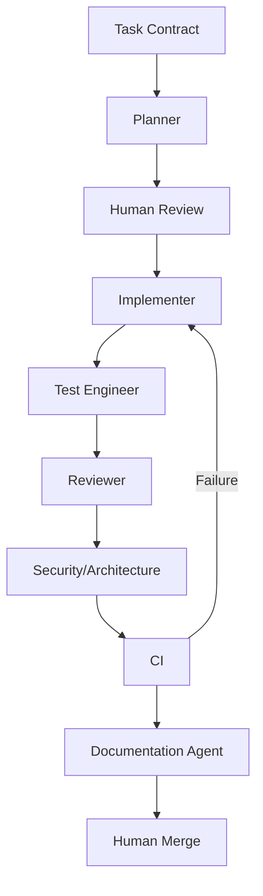

## 12. Compose Profiles

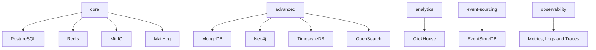
